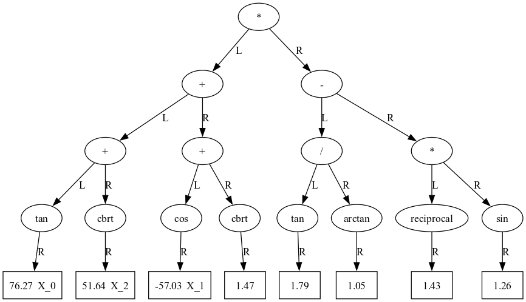

# CI2024_project-work
Repository for the final project of the Computational Intelligence 2024-2025 course at Politecnico di Torino.

## Notes on project realization
This project was done in collaboration with [Michele Perseo S331553](https://github.com/mickp18/)

Some ideas were shared with and taken from [Lorenzo Cuccu S330260](https://github.com/Lorkenzo)


## Introduction

The goal of this project is to implement a symbolic regression algorithm based on a genetic programming approach. An evolutionary algorithm is used to predict the mathematical expression of a function given some input values and the desired output values. The format of the given values is the following: 
- Input values `X` -> multidimensional array of shape (n_features, n_samples)
- Output values `Y` -> 1d array of shape (n_samples,)

Using the genetic programming approach, we need to find an expression of the form: *y = f(x)*, where *f(x)* will be the predicted function of form similar to:
(Uop<sub>1</sub>(A<sub>1</sub> * X<sub>1</sub>)) Bop<sub>1</sub>(Uop<sub>2</sub>(A<sub>2</sub> * X<sub>2</sub>)) ... ((Uop<sub>n</sub>(A<sub>n</sub> * X<sub>n</sub>)) Bop<sub>n-1</sub>(Uop<sub>n+1</sub>(C<sub>1</sub>)))Bop<sub>n</sub>(Uop<sub>n+2</sub>(C<sub>2</sub>))...  where 

- Uop<sub>1</sub>, Uop<sub>2</sub>, Uop<sub>n</sub> are unary operators (sin, cos, log...), where each unary operator can have as argument either a coefficient times an input variable, or a constant.
- Bop<sub>1</sub>, Bop<sub>2</sub>, ..., Bop<sub>n-1</sub> are binary operators (+,-,*,/)
- A<sub>1</sub>, A<sub>2</sub>, ..., A<sub>n</sub> are multiplication coefficients.
- X<sub>1</sub>, X<sub>2</sub>, ..., X<sub>n</sub> are input variables.
- C<sub>1</sub>, C<sub>2</sub>, ..., C<sub>n</sub> are constants.

### General Idea

To achieve this we thought of the possibility of representing any mathematical formula, as it's done in the genetic programming approach, as a binary tree data structure. We imagined it as a tree where each node stores either a variable value, a constant value, or an operator. In the case of binary operators, the left and right children of the node represent the arguments of the operator, whereas in the case of unary operators, the only child of the node is the argument of the operator; in our representation, we use always the right child.
The trickiest part was finding a way to generate initial solutions that were as random as possible, but at the same time that could be useful and reasonable to find a good solution from. To optimize this process we thought of various ways to generate:
- multiplication coefficients assigned to each variable
- meaningful constant values based on the input and output values of the problem
- weights to be assigned to each unary operator to define its probability to being chosen.

The next step was to add an evolutionary algorithm that through recombinations and mutations (and other techniques seen in class) tries to find the best possible solution.

## Repository Structure

We divided our program in the following way, in order to achieve better modularity and clearer organization of the code.
- [/data](./data): data given to us in the form of input values `X` and output values `Y`
- [/s331553.py](s331553.py): contains the resulting function found by the algorithm for each problem given in the form 
    ```python
    def fX(x: np.ndarray) -> np.ndarray: 
        # mathematical expression represented using numpy operations, e.g.:
        x[0] + np.sin(x[1]) / 5
    ...
    ```

- [/src](./src): source code of the project
    - [generators.py](./src/generators.py) Contains functions to generate and optimize coefficients and constants.
    
    - [globals.py](./src/globals.py) Contains global variables used throughout the program, they are initialized as a function of the desired input program.
        - `BINARY_OPERATORS`: Dictionary containing all available binary operators to be used in the predicted formula.
        - `UNARY_OPERATORS`: Dictionary containing all available unary operators to be used in the predicted formula.
        - `X`: multidimensional array of shape (n_features, n_samples) representing input values.
        - `Y`: 1d array of shape (n_samples,) representing output values.
        - `PROBLEM_SIZE`: Integer representing n_features, i.e. how many different X input variables were given.
        - `VARIABLES_MAP`: Dictionary mapping each X input variable to its actual array of values, in the form  
        {'X_0': [1, 2, 3], 'X_1': [4, 5, 6], 'X_2': [7, 8, 9]}
        - `COEFFICIENT_RANGES`: A list of tuples, where each tuple contains the min and max values of a range of coefficients for each feature in x.
        - `CONSTANT_RANGES`: A dictionary containing the ranges of constant values for different operations. The keys are the operation names ('add_sub', 'mult_div', 'small', 'powers'), and the values are tuples of the min and max values of the range.
        - `UNARY_WEIGHTS`: A dictionary where the keys are the operators and the values are their corresponding weights, representing the probabilities of being picked for every unary operator.
        

    - [mutations.py](./src/mutations.py) Contains functions to perform mutations on the tree.
    
    - [print_tree.py](./src/print_tree.py) Contains functions to print the tree as a string, in various readable formats.
    
    - [symreg_gp.ipynb](./src/symreg_gp.ipynb): It is the notebook used for the development of the evolutionary algorithm. Contains initialization of constants to be used in such algorithm:
        - `POPULATION_SIZE`: Integer representing how many individuals are going to be in the initial population.
        - `OFFSPRING_SIZE`: Integer representing how many offsprings can be created at each iteration of the evolutionary algorithm
        - `MAX_ITERATIONS`: Integer representing how many iterations the evolutionary algorithm can perform at maximum before stopping.

    
    - [tree_node.py](./src/tree_node.py) Contains functions to represent and manipulate the `TreeNode` class.

    - [tree.py](./src/tree.py) Contains functions to represent and manipulate the `Tree` class.
    
    - [utils.py](./src/utils.py) Contains utility functions to assist in the development of the algorithm. 
        - Constraint checks for operators
        - MSE calculation
        - Score computation for individuals in the population
        - Sorting of population
        - Similarity calculation for given operator based on input and output values
        - Weights of unary operators computation
     
    - [visualize_tree.py](./src/visualize_tree.py) Contains functions to visualize the tree. Graphviz tool is used to draw the trees as a directed graph.
    
## Genetic programming approach

To solve the problem we sticked to the basic concepts of genetic programming, which can be summarized as follows:

### Representation

To represent the problem, genetic programming makes use of a binary tree representation of the individuals, so that's what we decided to follow. We created 3 main classes:

- class `TreeNode` to represent the nodes of the tree, which has attributes
    - Value: The value represented by the node (can be an operator, variable, or a constant)
    - Left: The left child of the node
    - Right: The right child of the node
    - Coefficient: The coefficient applied to the value of the node
        - 1 if value is a constant
        - None if value is an operator
        - Float number if value is a variable
    - Depth: The depth of the node.
        - 1 for a leaf node
        - Max depth of the left and right children + 1 for the current node

- class `Tree` to represent the tree itself, which has attributes:
    - root: `TreeNode` object representing the root of the tree
    - depth: The maximum depth of the tree
- class `Individual` to represent an individual of the population. It is defined as:
    - genome: The `Tree` object representing the individual
    - fitness: The fitness of the individual

### Recombination

In order to perform recombination operations, we implemented a function that exchanges subtrees of two parents. In this way an `Individual` (the child) will be created with a genome that is a combiantion of the parents' genomas. In particular a random node is chosen from the tree representing the first parent. This will be the root of the subtree that will be inserted in the tree representing the second parent. In order to acheive this, we take a random target node in the second parent's tree, and we check if the substitution would be possible. This is done to avoid creating invalid mathematical expressions. If the process fails we try to select a new target node from the second parent's tree. If all the nodes avaialble are estinguished, we  try to change the source node of the subtree taken from the first parent, and we repeat the process until we find a valid substitution. If all the possible source nodes are exhausted, it means that no recombination was possible between the 2 parents, and a mutation is performed instead.

### Mutations

Other than recombination, we implemented 6 different mutations. The idea was to have diverse possibilities when doing a mutation to the tree. Our idea was to implement mutations that could also decrease the size of the trees, not just increment them. That's why the specific mutation is selected using a weighted random choice based on the depth of the tree. This is done in order to make the EA  algorithm more efficient and faster, since it is less likely to generate trees with very high complexity and depth. The mutations implemented are the following:
- subtree mutation: replace entire subtree with a new random generated tree
- point mutation: change single node value. So if a binary operator is selected, a new binary operator will be chosen. If a variable is selected, a new variable will be chosen, and so on for all the other cases.
- permutation: chosen a random node, exchange its right and left childern. 
- hoist mutation: take a subtree and make it the root of the tree
- expansion mutation: take a random leaf and replace it with a new subtree
- collapse mutation: take a node and replace its subtree with a leaf of the tree

We tried to assign mutations weights in a way that ensured good diversity and exploration of the search space, while keeping the solutions generated reasonable in size and complexity. That's why the weights are higher for subtree mutation and point mutation for example, but when the tree depth increases too much, we increase the weights of hoist and collapse mutation, in order to favour a reduction of the complexity of the tree.

### Population model

We started by implementing a generational population model for our evolutionary algorithm, in which, at each iteration, the set of newly created offsprings replaces the set of previously existing individuals. This approach would have guaranteed a greater variety in the population at each iteration, but the fact that `OFFSPRING_SIZE` had to be at least 3 times `POPULATION_SIZE` implied that each iteration of the EA would have taken too long, since it has to loop for `OFFSPRING_SIZE` times. To solve this we started by decreasing `POPULATION_SIZE`, but we noticed that we were ending up with an initial population being too small.
We then switched to the steady-state population model, which requires `OFFSPRING_SIZE` to be less than `POPULATION_SIZE`. In this way we would not be generating too many offsprings at each iteration of the EA while also keeping a broader initial population, since this model consists in offspring being added to the previously existing population, and in making them compete for survival against parents too.
Using this model we immediately noticed a decrease of the time required by the EA to run and an increase of the scores of our solutions.

### Parent selection

We used a fitness proportional parent selection: each individual i has a probability of being choosen computed as:  
p<sub>i</sub> = s<sub>i</sub> / ∑<sub>j</sub> s<sub>j</sub>  
where s<sub>i</sub> is computed as the difference between the score of the individual i and the worst score found so far, passed as a parameter to the function.

### Survivor selection

To perform the survivor selection and to select the parents we implemented a function to "put together" the elements contained in the fitness, in order to have only one number that takes into account both elements contained in it: the MSE and the percentage of correct signs found by our formula. This number is then used to perform rankings, as in the survivor selection: after appending the offsprings to the parents, we sort the resulting population by this obtained score, and then we keep only the `POPULATION_SIZE` best ones, which are then going to be used as the initial population for the next iteration of the EA. 

## Genetic programming implementation

### Fitness computation

In order to evaluate the fitness of the individuals, we decided to measure how a certain solution performs in terms of both mean squared error and percentage of correct sign predictions. The mean square error shows how far the solution is from the true function, while the percentage of correct sign predictions shows how well the solution predicts the sign of each predicted value compared to the true sign.
The MSE was occasionally increased by some possible penalties assigned to the individual, if:
- the depth exceeds a certain threshold
- the number of variables is lower than the given number of variables for that problem

In this way we tried to penalize the solutions that are too complex and/or too simple,or that could lead to not meaningful results.
The 2 attributes of the fitness are computed together to obtain a score from 0 to 1. The score is obtianed by normalizing the MSE and the percentage of correct sign predictions to [0,1] and then combining them with a weighted sum. The weight describes how much the MSE should be taken into account in the final score compared to the percentage of correct sign predictions.


### Initialization

We initialize the population by creating `POPULATION_SIZE` instances of the class `Individual`, where each instance has as genome an object of the class `Tree`, obtained by calling a function that randomly creates an initial binary tree given the desired set of input variables. An initial tree is structured as follows: the number of leaves is equal to the smallest power of 2 greater than the number of input variables, so that all variables are chosen once, and any eventual difference between the number of leaves and variables will be taken by constants. For example, if there are 5 input variables, X_0 to X_4, there will be 8 leaves: the 5 input variables, each multiplied by a coefficient, plus 3 constants. All the leaves are set as right child of a unary operator, with the left child of such operator being set always to `None`. Then these unary operators are grouped together by nodes representing binary operators recursively all the way up to the root, as in this scheme that shows the structure of an initial tree as if 3 input variables were provided:

```
                    B
           /                  \
          B                    B    
     /        \            /        \
    U          U          U          U
  /    \     /    \     /    \     /    \
None  X_0  None  X_1  None  X_2  None  C_1
```

### Tournament

To start from a good population, after creating a random population, we run a tournament selection. The tournament divides the population in `n_tour` groups, and each group selects a winner (based on the score of the individuals), ending up with a new population of `n_tour` individuals. If the number of tournaments chosen is lower than the popoulation size, the winners are used to generate the remaining individuals of the population, applying mutations on them.

### Evolutionary Algorithm

The evolutionary algorithm puts together all the previously described steps to obtain the best possible solution. It receives the population it has to work on and keeps track of some important parameters, like the best individual found so far and its score. The algorithm is run for a `MAX_ITERATIONS` number of iterations, and the best individual found at the end will be returned. In order to do so, for every iteration it is going to generate, after choosing the parents, an `OFFSPRING_SIZE` number of  new individuals, by either applying crossover (with probability 70%) or mutation (with probability 30%). The new individual is then added to the population, and once the new population has been sorted by score we keep only the `POPULATION_SIZE` best ones. This is repeated for each iteration.

#### Elitism and early stopping

In addition we decided to add a mechanism of elitism, which means that the best individual found so far is stored, and if after a certain number of iterations the best individual in the population has a score lower than the best individual found so far, we insert again that best individual in the population. If instead there are no improvements after a certain number of iterations, computed using a stagnation counter and a patience parameter, we stop the algorithm.


## Additional features

### Coefficients and constants generation

In order to obtain more precise solutions we decided to generate possible ranges that can be used to pick a random coefficient or constant, based on some mathemtaical relationships between input values of X and output values of Y.
This was done to, for example, increase or decrease, the magnitude of the variables' values to match the magnitude of the output values. Otherwise it would be almost impossible to randomly reach a good solution. Same was done for constant values, that based on the operator applied on them can be chosen accordingly. 

### Unary operators weights 

Another feature that we decided to implement is computation of the similarity between the value obtained when applying a unary operator to a set of variables and the value of the ouput. This was done to assign a higher probability to operators that are likely to be useful for the problem.

### Fine tuning

Since randomly picked coefficients and constants are a good starting point but not an optimal solution since they lack precision, we decided to fine tune  them after the end of the research of the best individual by the evolutionary algorithm. This means that what is returned as the best possible solution will then be refined by fine tuning the values of the multiplicaiton coefficients and the constants present in the leaf nodes of the solution. To do this we randomly select one of the leaves and try to increase or decrease the value of the coefficient or the constant, by a small amount (like 0.2%). If the fitness improves, we continue the operation until we don't find any other improvement. At this point a new coefficient/constant is chosen and the same process is repeated. This significally increased the accuracy of the solution, ending up in increasing the score of the solution. 

### Tree visualization

In order to visualize the resulting formulas, we started by implementing functions that would print them on the output cells represented as strings, but we soon realized that it was becoming too difficult to quickly understand the tree structure that composed them. We then adopted the graphviz library to draw a directed graph as an image to be displayed in the output cells. We implemented a function that, given the root of the tree to be drawn, creates the corresponding directed graph, where each node contains a node of the tree, i.e an operator, a variable or a constant, and each directed edge represents a parent - child relationship between two nodes of the tree. Moreover, to improve readability, the nodes representing the tree leaves are drawn with a squared border, whereas all other nodes are drawn with an elliptical border, as in the following example:



## Conclusion and results

Our approach resulted being very effective in certain cases, while in others not as much. We are still very happy on how we managed to lay out our solution, considering also the time at our disposal. There are certainly other techniques that we could have added and that we also thought of, but some, because of complexity or time, couldn't be implemented. We noticed for example that in some cases our algorithm gets stuck in local optimal solutions and finds it very difficult to get out of them. But on the other hand, if the random initial solution is quite good, it manages to find a very good solution. So what we could probably improve is the generation of the initial solutions and some ways to restart the search if it gets stuck on a population that will always lead to a local optima.
Another aspect we worked quite hard on is the validation of the mathematical expressions that are created each time a solution is generated or modified. In fact we always get reasonable and valid expressions, and we managed to do that in an efficient way, making the search, recombination and mutation processes very fast.
